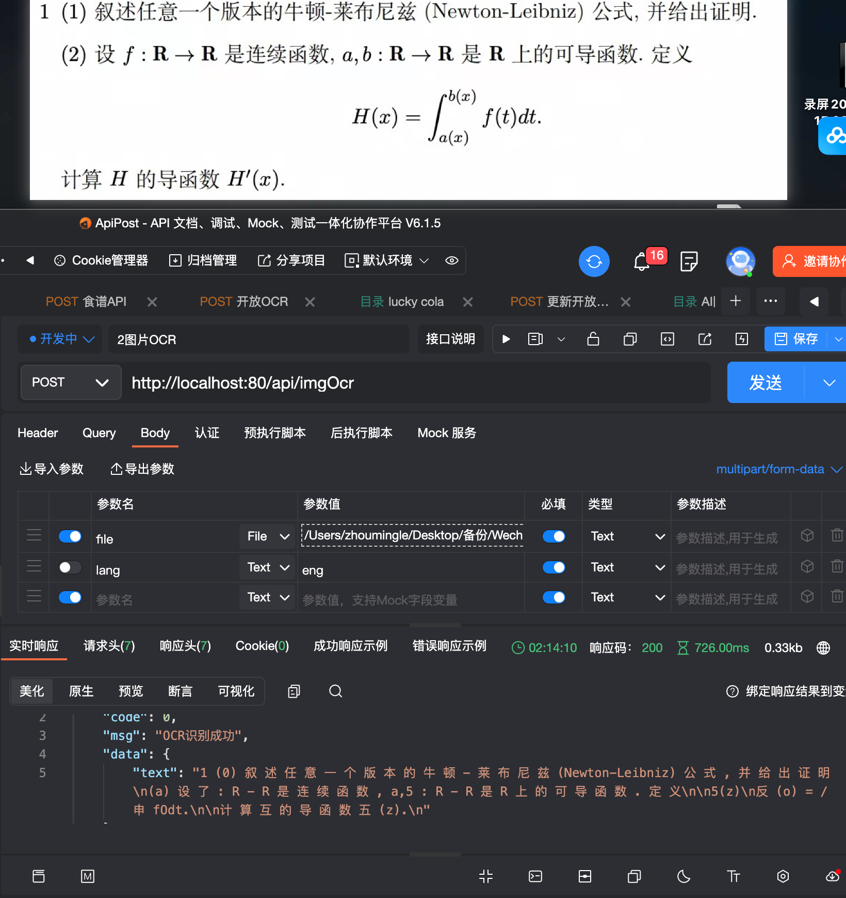

# OCR Image Recognition Service

English | [简体中文](README.md)

This is an OCR image recognition service developed based on Node.js and Tesseract OCR engine, supporting Simplified Chinese and English text recognition.


## Directory Structure

```
ocr-server/
├── app.js              # Main program entry
├── ocrRouter.js        # OCR API router
├── tempImgs/           # Temporary image storage directory
├── tessdata/           # Tesseract language data directory
│   ├── chi_sim.traineddata  # Simplified Chinese language pack
│   └── eng.traineddata      # English language pack
└── node_modules/       # Project dependencies
```

## Installation Steps

1. Ensure Node.js environment is installed
2. Clone or download this project to your local machine
3. Make sure the `tessdata` directory contains `chi_sim.traineddata` and `eng.traineddata` language data files
4. Execute the following command in the project root directory to install dependencies:

```bash
yarn install
# or use npm
npm install
```

5. Start the service:

```bash
yarn start
# or use npm
npm start
```

## API Documentation

### 1. Image File Recognition API

**Request URL:** `/api/imgOcr`

**Request Method:** POST

**Content-Type:** `multipart/form-data`

**Parameters:**

| Parameter | Required | Type   | Description                     |
|-----------|----------|--------|---------------------------------|
| file      | Yes      | File   | Image file to recognize (max 3MB) |
| lang      | No       | String | Recognition language, options: chi_sim, eng, default is chi_sim |

**Supported image formats:** png, jpeg, jpg

**Request example:**

```bash
curl -X POST \
  http://localhost:80/api/imgOcr \
  -H 'Content-Type: multipart/form-data' \
  -F 'file=@/path/to/your/image.jpg' \
  -F 'lang=chi_sim'
```

**Response example:**

```json
{
  "code": 0,
  "msg": "OCR recognition successful",
  "data": {
    "text": "Recognized text content"
  }
}
```

### 2. Base64 Image Recognition API

**Request URL:** `/api/base64Ocr`

**Request Method:** POST

**Content-Type:** `application/json`

**Parameters:**

| Parameter   | Required | Type   | Description                     |
|-------------|----------|--------|---------------------------------|
| base64Image | Yes      | String | Base64 encoded image data       |
| lang        | No       | String | Recognition language, options: chi_sim, eng, default is chi_sim |

**Supported image formats:** png, jpeg, jpg (Base64 encoded)

**Request example:**

```bash
curl -X POST \
  http://localhost:80/api/base64Ocr \
  -H 'Content-Type: application/json' \
  -d '{
    "base64Image": "data:image/jpeg;base64,/9j/4AAQSkZ...(Base64 encoded image data here)",
    "lang": "chi_sim"
}'
```

**Response example:**

```json
{
  "code": 0,
  "msg": "OCR recognition successful",
  "data": {
    "text": "Recognized text content"
  }
}
```

## Error Codes

| Error Code | Description                                  |
|------------|----------------------------------------------|
| 0          | Success                                      |
| -1         | Please upload file image resource (form-data format) |
| -2         | Maximum image size is 3MB                    |
| -3         | Only supports (png, jpeg, jpg) image formats |
| -4         | OCR recognition failed                       |
| -11        | Parameter error, please check parameters     |
| -21        | Invalid Base64 format                        |
| -91        | OCR processing exception                     |
| -777       | OCR recognition failed (file path is bad)    |
| -9999      | OCR recognition failed (server internal error) |

## Notes

1. Ensure images are clear and readable to improve recognition accuracy
2. Image size limit is 3MB
3. Currently only supports Simplified Chinese (chi_sim) and English (eng) recognition
4. The default language for recognition is Simplified Chinese (chi_sim)

## Troubleshooting

1. If you encounter language pack loading errors, ensure the corresponding language data files are in the `tessdata` directory
2. Make sure the server has sufficient permissions to access temporary folders and language data directories

## Developer Information

This OCR service is developed based on the following technologies:
- Node.js
- Express.js
- Tesseract OCR (via node-tesr package)
- fs-extra
- multiparty

## Copyright

© 2023 OCR Server@luckycola.com.cn 